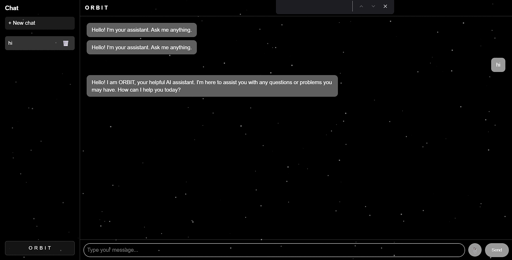

# ORBIT - AI

A lightweight, local AI chat backend powered by **Ollama** + **Express.js**.\
Send messages to a Gemma 2B model (or any Ollama model you prefer) through a simple web API.

**Current status**: Basic working prototype with a single `/chat` endpoint.


## Screenshots




## Features

- Simple REST API endpoint: `POST /chat`
- Streams responses from local Ollama instance
- Minimal dependencies
- Runs completely offline (after model download)

## Folder Structure

```
orbitbackend/
├── node_modules/           # (auto-generated)
├── .env                    # can store PORT, OLLAMA_URL, etc.
├── package.json
├── package-lock.json
├── server.js               # ← main Express server file
└── README.md               # ← this file
```

## Prerequisites

- **Windows / macOS / Linux**
- **Node.js** ≥ 18
- **Ollama** installed and running ([https://ollama.com](https://ollama.com))

## Installation Steps

### 1. Install Ollama

- Download & install from → [https://ollama.com/download](https://ollama.com/download)
- Pull the model:

```bash
ollama pull gemma:2b
```

(You can later use other models like `llama3.1:8b`, `mistral`, `phi3`, etc.)

### 2. Start Ollama server

Keep this running in a separate terminal:

```bash
ollama serve
```

(Default address: [http://localhost:11434](http://localhost:11434))

### 3. Open the project folder

```bash
cd path/to/orbitbakend
```

### 4. Install dependencies

```bash
npm install
```

Required packages:

- express
- node-fetch

### 5. (Optional) Create .env file

```env
PORT=3000
OLLAMA_URL=http://localhost:11434
```

(Currently hardcoded in `server.js` — can be improved later.)

### 6. Run the server

```bash
node server.js
```

Expected output:

```
🚀 Orbit running at http://localhost:3000
```

### 7. Test it

- Browser: [http://localhost:3000](http://localhost:3000) (if `index.html` exists in `/public`)
- API test:

```bash
curl -X POST http://localhost:3000/chat \
-H "Content-Type: application/json" \
-d '{"message": "What is 2 + 2?"}'
```

## Troubleshooting

| Problem                      | Possible Cause             | Solution                        |
| ---------------------------- | -------------------------- | ------------------------------- |
| Cannot find module 'express' | Dependencies not installed | Run `npm install`               |
| fetch failed / ECONNREFUSED  | Ollama not running         | Run `ollama serve`              |
| model 'gemma:2b' not found   | Model not downloaded       | Run `ollama pull gemma:2b`      |
| Red X on folders             | OneDrive sync issue        | Move project outside OneDrive   |
| server.js red X              | File corruption            | Re-save or restore file         |
| Server crashes               | Syntax error               | Check terminal error message    |
| API returns fallback message | Ollama error               | Check Ollama logs               |
| Very slow response           | Low RAM / CPU              | Use smaller model or GPU Ollama |

## Recommended Next Steps

- Add proper error handling & status codes
- Support streaming responses (SSE)
- Add model selection
- Build frontend UI in `/public`
- Input validation & rate limiting
- Docker support

---

***MADE WITH CURIOUSITY***  BY **Anshuman - Dev** [ **Anshuman615** ]

**Enjoy building with ORBIT !**

